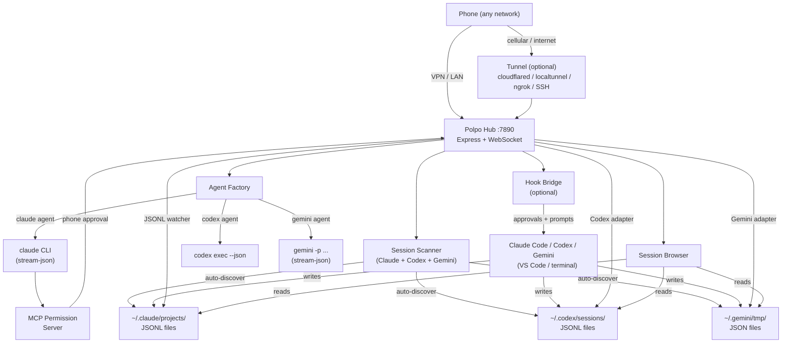

<h1 align="center">Polpo</h1>

<p align="center">
  
</p>

<p align="center"><strong>Work on Claude Code, Codex, and Gemini from your phone.</strong></p>

Polpo lets developers send prompts, see responses, and control Claude Code, OpenAI Codex CLI, and Google Gemini CLI sessions from any mobile device over VPN, Wi-Fi, LAN, or a public tunnel.

## Why

AI coding sessions can run for minutes while reading files, writing code, and running tests. During that time, developers are tethered to their terminal waiting to approve tool calls, review output, or send the next prompt.

Polpo frees you from the keyboard. Grab a coffee, kick off a refactor while waiting for a train, or review tool calls from an airport lounge - your phone becomes a full remote control for Claude Code, Codex, and Gemini. You see every tool call as it happens, approve or reject actions with a tap, send follow-up prompts, and abort tasks when something goes wrong. All in real time, from any network.

## Architecture

Four integration modes, supporting **Claude Code**, **OpenAI Codex CLI**, and **Google Gemini CLI**:

- **Session** - spawns `claude`, `codex exec --json`, or `gemini --output-format stream-json` with full bidirectional control from phone, including MCP-based tool approval
- **Auto-Discovery** - watches `~/.claude/projects/`, `~/.codex/sessions/`, and `~/.gemini/tmp/` for active session files using `fs.watch()`, auto-registers sessions on the dashboard with real-time conversation sync — no setup needed
- **Hooks** - taps into existing terminal sessions via Claude Code hooks for terminal prompt forwarding and phone-based tool approval
- **Session Browser** - discovers and displays past sessions from Claude Code, Codex, and Gemini session files, with the ability to resume them

## Requirements

- **Node.js** 18+ (for built-in test runner; 16+ works for everything else)
- **Claude Code** CLI installed and authenticated, **and/or** **Codex CLI** installed and authenticated, **and/or** **Gemini CLI** installed and authenticated
- **macOS** or **Linux** (Windows is not currently supported)

### macOS Notes

Polpo works natively on macOS - no extra setup needed. For tunnel providers:

```bash
# cloudflared (recommended)
brew install cloudflare/cloudflare/cloudflared

# ngrok (optional)
brew install ngrok
```

## Quick Start

### 1. Install

```bash
cd polpo && npm install
```

### 2. Start the Hub

```bash
node bin/polpo.js server
```

### 3. Start a Session

```bash
# New Claude Code session
node bin/polpo.js session --cwd /path/to/project --name "Backend API"

# New Codex session
node bin/polpo.js session --agent codex --cwd /path/to/project --name "Codex Task"

# New Gemini session
node bin/polpo.js session --agent gemini --cwd /path/to/project --name "Gemini Task"

# Resume an existing session
node bin/polpo.js session --resume <session-id>
```

### 4. Open on Your Phone

Navigate to `http://<your-computer-ip>:7890` on your phone's browser.

The dashboard shows active sessions, past session history, and lets you send prompts, watch tool calls, approve or reject actions, and abort tasks.

## Features

<p align="center">
  
</p>

| Feature | Description |
|---------|-------------|
| Full Remote Control | Send prompts and see responses from your phone |
| Real-time Streaming | Tool calls, results, and text stream as they happen |
| Phone-based Approval | Approve or reject tool use from your phone (MCP for sessions, hooks for VS Code) |
| Plan Review | Review proposed plans with full markdown rendering before approving |
| Question Answers | Answer multi-choice questions from your phone when Claude asks |
| Auto-approve | Tap "Approve All" to auto-approve tool calls (plans and questions always require review) |
| File Attachments | Send any file from your phone - images, PDFs, code, documents, etc. |
| Multi-Agent | Full support for Claude Code, OpenAI Codex CLI, and Google Gemini CLI |
| Session Browser | Browse past sessions from Claude Code, Codex, and Gemini with conversation history |
| Session Resume | Resume any past session directly from the phone dashboard |
| Auto-Discovery | Active sessions detected automatically via filesystem watching — no hooks required |
| Live History Sync | Terminal/VS Code conversations synced to phone in real-time via JSONL watcher |
| Phone Takeover | Take over a terminal session from your phone to send prompts |
| Instance Dashboard | See all active sessions at a glance with live status (busy/idle derived from JSONL) |
| Tool Call Cards | Bash commands, file edits, and searches rendered as mobile-native cards |
| Abort | Stop any running task with a tap |
| Multi-Instance | Run and monitor unlimited parallel sessions |
| Cost Tracking | Per-turn API costs displayed inline |
| Mobile-First UI | Dark OLED theme, touch-optimized, safe-area support, responsive layout |
| Tunnel Access | Expose the hub over the internet with `--tunnel` (cloudflared, localtunnel, ngrok, SSH) |

> **Note**: Polpo streaming is **near real-time**, not strictly real-time. Auto-discovery relies on filesystem events (`fs.watch`) which have inherent OS-level latency; JSONL/JSON watchers debounce file changes; agents using one-shot process invocation (Codex, Gemini) accumulate deltas before flushing; and when `fs.watch` is unavailable (e.g. inotify limit exhaustion), the system falls back to periodic polling. In practice, latency is typically under one second, but it is not zero.

## Security

When exposing Polpo over a tunnel or untrusted network, authentication prevents unauthorized access. Auth is **auto-enabled** for tunnels and can be manually enabled for any deployment.

### Auth Modes

| Mode | Flag | Token | MFA | Use Case |
|------|------|-------|-----|----------|
| **token** | `--auth token` | Single-use URL token | No | Quick tunnel access (default for `--tunnel`) |
| **pin** | `--auth pin` | URL token + 4-digit PIN | Yes | Shared networks, added protection |
| **paranoid** | `--auth paranoid` | URL token + TOTP (6-digit) | Yes | Long-lived tunnels, highest security |

### How It Works

<p align="center">
  
</p>

- **Token**: A `crypto.randomBytes(32)` base64url token is baked into the QR code URL. It is single-use - after the first scan, it is burned and cannot be reused.
- **PIN**: A 4-digit PIN is displayed in the terminal. After scanning the QR code, the phone must enter the PIN. After 3 failed attempts, a new PIN is generated.
- **TOTP**: Uses RFC 6238 TOTP with a persistent secret stored in `~/.config/polpo/totp.json`. On first run, the secret and `otpauth://` URI are displayed. Add it to any authenticator app.
- **Sessions**: After authentication, a session cookie (`polpo_session`, HttpOnly, SameSite) is set. Subsequent requests use the cookie.
- **Agents**: Agents and hooks use the raw token via `Authorization: Bearer <token>` header - the token is not burned for agent connections.

### Usage

```bash
# Tunnel with default auth (token-only, auto-generated)
polpo server --tunnel

# Tunnel with PIN
polpo server --tunnel --auth pin

# Tunnel with TOTP
polpo server --tunnel --auth paranoid

# LAN with manual auth
polpo server --auth token

# Agents pass the token
polpo session --server ws://host:7890 --token <token>
```

The token is printed in the terminal output for connecting agents and bridges.

### Environment Variables

| Variable | Description |
|----------|-------------|
| `POLPO_TOKEN` | Auth token for agents/bridges (alternative to `--token` flag) |

## Tunnel Access (No VPN Required)

Add `--tunnel` to expose the hub over the internet. A public URL and QR code are printed for your phone to scan - no VPN or same-network requirement.

```bash
# Auto-detect best available provider
node bin/polpo.js server --tunnel

# Use a specific provider
node bin/polpo.js server --tunnel cloudflared
node bin/polpo.js server --tunnel localtunnel
node bin/polpo.js server --tunnel ngrok

# SSH reverse tunnel to your own server
node bin/polpo.js server --tunnel ssh --tunnel-host user@myserver.com
node bin/polpo.js server --tunnel ssh --tunnel-host user@myserver.com --tunnel-port 8080
```

### Provider Comparison

| Provider | Install | Signup | Auto-detect | Notes |
|----------|---------|--------|-------------|-------|
| **cloudflared** | [Download](https://developers.cloudflare.com/cloudflare-one/connections/connect-networks/downloads/) | No | Yes (1st) | Best reliability, free quick tunnels |
| **localtunnel** | Bundled | No | Yes (2nd) | Always available fallback (npm dep) |
| **ngrok** | [Download](https://ngrok.com/download) | Yes | No | Requires auth token, stable URLs available |
| **ssh** | Built-in | No | No | Requires `--tunnel-host`, uses your own server |

Auto-detect tries cloudflared first, then falls back to localtunnel. ngrok and SSH require explicit `--tunnel <provider>` since they need configuration.

If the tunnel fails, the server still runs normally on LAN.

## Remote Sessions (Full Control)

The `session` command spawns a CLI process with JSON streaming and gives your phone full bidirectional control. Use `--agent` to select the agent type.

```bash
# Claude Code (default)
node bin/polpo.js session --cwd /path/to/project --name "My Task"

# OpenAI Codex
node bin/polpo.js session --agent codex --cwd /path/to/project --name "Codex Task"

# Google Gemini
node bin/polpo.js session --agent gemini --cwd /path/to/project --name "Gemini Task"
```

### Tool Approval

When a session runs in `default` permission mode, an MCP permission server handles tool approval. When Claude needs to run a tool that requires permission, the request appears on your phone as a banner with three options:

- **Approve** - allow this single tool use
- **Approve All** - enable auto-approve for the rest of the session (all future tool calls are approved instantly without involving the phone)
- **Reject** - deny this tool use

<p align="center">
  
</p>

When auto-approve is active, a green "Auto-approve ON" indicator appears with a "Stop" button to disable it.

**Plans and questions always require review**, even when auto-approve is on. When Claude proposes a plan (`ExitPlanMode`), the full plan content is rendered with markdown (headings, tables, code blocks, lists) in a collapsible panel. When Claude asks questions (`AskUserQuestion`), the options appear as tappable radio buttons or checkboxes with a free-text "Other" fallback.

To skip approval entirely (use with caution):

```bash
node bin/polpo.js session --cwd /path/to/project --permissions bypass
```

### Options

| Flag | Description |
|------|-------------|
| `--name <name>` | Display name for this session |
| `--cwd <dir>` | Project directory (default: current) |
| `--resume <id>` | Resume an existing session |
| `--model <model>` | Model to use (e.g. opus, sonnet for Claude; gpt-5-codex for Codex; flash, pro for Gemini) |
| `--permissions <mode>` | `default` (phone approval via MCP) or `bypass` (skip all) |
| `--agent <type>` | Agent type: `claude` (default), `codex`, or `gemini` |
| `--server <url>` | Hub WebSocket URL (default: `ws://127.0.0.1:7890`) |
| `--token <token>` | Auth token (or set `POLPO_TOKEN` env var) |

## Session Browser

The dashboard automatically discovers past sessions from `~/.claude/projects/` (Claude Code), `~/.codex/sessions/` (Codex), and `~/.gemini/tmp/` (Gemini) and displays them as cards with the session's first prompt as the title. Each card shows an agent type badge (Claude, Codex, or Gemini). Tap a session to view its full conversation history, or resume it to continue working from your phone.

Sessions are loaded from JSONL/JSON files and deduplicated to show clean conversation threads. Use the `?source=claude|codex|gemini|all` query parameter on the `/api/sessions` endpoint to filter by agent type.

## Auto-Discovery

The Polpo server automatically discovers active sessions from Claude Code, Codex, and Gemini by watching their respective session directories:

- **Claude Code**: `~/.claude/projects/<project-slug>/*.jsonl`
- **Codex CLI**: `~/.codex/sessions/*.jsonl`
- **Gemini CLI**: `~/.gemini/tmp/<project-slug>/chats/session-*.json`

This is event-driven using `fs.watch()` — no polling, no hooks, no setup.

When a session is detected:
1. An instance appears on the phone dashboard with the appropriate agent type badge
2. A JSONL watcher starts streaming the full conversation in real-time (using the correct adapter for each agent's JSONL format)
3. Status (busy/idle) is derived from the JSONL content — user messages set busy, turn completions set idle

Auto-discovery works with any interface that writes JSONL/JSON session files (terminal CLI, VS Code extension, web).

## Codex CLI Support

Polpo supports OpenAI Codex CLI with full parity:

- **Session spawning** — `polpo session --agent codex` spawns `codex exec --json` processes
- **Multi-turn** — each prompt spawns a new process using `codex exec resume <thread-id> --json "prompt"`, keeping the conversation context
- **Auto-discovery** — watches `~/.codex/sessions/` for active JSONL files
- **Session browser** — lists past Codex sessions alongside Claude Code sessions
- **Takeover** — take over a terminal Codex session from your phone
- **Event translation** — Codex's event format (`thread.started`, `item.*`, `turn.*`) is translated to Polpo's uniform message format

### Codex-Specific Notes

- Codex uses one-shot process invocation (`codex exec`) rather than stdin streaming. Multi-turn requires killing and respawning with `resume`, which adds ~1-2s between prompts.
- Permission handling uses `--full-auto` for bypass mode and `-a on-request` for default mode.
- Images are attached via `--image <path>` flag; other files are referenced in the prompt text.
- The dashboard shows a green "Codex" badge on Codex instances, and a purple "Claude" badge on Claude instances.

## Gemini CLI Support

Polpo supports Google Gemini CLI with full parity:

- **Session spawning** — `polpo session --agent gemini` spawns `gemini -p "..." --output-format stream-json` processes
- **Multi-turn** — each prompt spawns a new process using `gemini --resume <session-id> -p "..." --output-format stream-json`, keeping the conversation context
- **Auto-discovery** — watches `~/.gemini/tmp/<project>/chats/` for active JSON session files
- **Session browser** — lists past Gemini sessions alongside Claude Code and Codex sessions
- **Takeover** — take over a terminal Gemini session from your phone
- **Event translation** — Gemini's stream-json format (`init`, `message`, `tool_use`, `tool_result`, `error`, `result`) is translated to Polpo's uniform message format

### Gemini-Specific Notes

- Gemini uses one-shot process invocation (like Codex) rather than stdin streaming. Multi-turn requires killing and respawning with `--resume`, which adds ~1-2s between prompts.
- Permission handling uses `--approval-mode=yolo` for bypass mode (Gemini does not support MCP).
- Images and files are attached via `@<path>` syntax appended to the prompt text.
- Session files are JSON (not JSONL) — the adapter re-reads the full JSON on file changes and diffs message counts.
- The dashboard shows a blue "Gemini" badge on Gemini instances.

### Requirements

```bash
npm install -g @google/gemini-cli
```

Gemini CLI must be authenticated (run `gemini` once to set up API key or Google account auth).

## Terminal Sync (Hooks)

Hooks are **optional** — auto-discovery handles session detection and conversation sync without them. Hooks add two capabilities:

- **Terminal prompt forwarding** — see what the terminal user types in real-time (via `UserPromptSubmit` hook)
- **Phone-based tool approval** — approve or reject tool calls from your phone (via `PreToolUse` hook with `POLPO_APPROVE=1`)

### Setup

```bash
# Print the hook config JSON
node bin/polpo.js hooks
```

Add the output to `~/.claude/settings.json`. The bridge daemon auto-discovers the server token from `~/.config/polpo/server.json` — no manual token passing needed.

> **Note**: Shell hooks from `settings.json` work with the `claude` CLI. The VS Code extension uses its own internal hook mechanism and does not execute shell hooks. For VS Code sessions, auto-discovery provides full conversation sync without hooks.

### Phone Takeover

Auto-discovered and hook instances are **read-only** — they mirror conversations from session files on disk, but have no backing agent process to accept prompts. Tap **Take Over** to spawn a real agent process (`claude --resume`, `codex exec resume`, or `gemini --resume`) that resumes the session with full prompt capability. The existing conversation history is preserved in the new instance. This is the same resume mechanism used by the Claude Code VS Code extension when selecting a previous conversation — there is no long-lived process to reconnect to; the CLI replays context from transcript files on each resume.

<p align="center">
  
</p>

When you return to your terminal, run `claude --continue` (Claude) or start a new session (Codex/Gemini) to reload the conversation. In VS Code, reload the window (`Ctrl+Shift+P` → "Reload Window") to pick up messages sent from Polpo — the VS Code extension caches conversations in memory and only re-reads session files on reload.

### Approval Mode

To enable phone-based tool approval for hook instances, set `POLPO_APPROVE=1`:

```json
{
  "matcher": "",
  "command": "POLPO_APPROVE=1 node /path/to/polpo/src/hooks/pre-tool-use.js"
}
```

## File Attachments

Tap the paperclip icon to attach files from your phone. Supported types:

- **Images** - sent as base64 to Claude's vision (multimodal)
- **PDFs** - sent as native document content blocks
- **Text/code files** - small files (up to 100KB) are inlined directly in the prompt; larger files are saved to disk and Claude reads them with the Read tool
- **Any other file** - saved to disk and referenced by path for Claude to read

## Mobile UI

- Dark theme optimized for OLED screens
- Full markdown rendering — headers, bold, italic, code blocks (with language labels), inline code, bullet/numbered lists, tables, blockquotes, links, horizontal rules, strikethrough
- Tool calls rendered as cards (Bash commands, file paths, search patterns)
- Tool results shown as collapsible code blocks
- Per-turn cost displayed inline
- Touch-friendly with 44px minimum touch targets
- Safe-area support for notched/island phones
- Responsive layout with breakpoints for small phones, landscape, and tablets
- Virtual keyboard handling (no content jump on iOS/Android)

## API

### REST Endpoints

| Method | Path | Description |
|--------|------|-------------|
| GET | `/api/sessions` | List discovered sessions (`?source=claude\|codex\|gemini\|all`) |
| GET | `/api/sessions/:id/history` | Get conversation history from JSONL |
| POST | `/api/sessions/:id/resume` | Resume a session (spawns wrapped agent) |
| GET | `/api/instances` | List all active instances |
| GET | `/api/instances/:id` | Get instance details |
| GET | `/api/instances/:id/conversation` | Get conversation history |
| POST | `/api/instances` | Register a new instance |
| DELETE | `/api/instances/:id` | Unregister an instance |
| POST | `/api/instances/:id/prompt` | Send a prompt |
| POST | `/api/instances/:id/approve` | Approve pending tool use |
| POST | `/api/instances/:id/reject` | Reject pending tool use |
| POST | `/api/instances/:id/auto-approve` | Toggle auto-approve for an instance |
| POST | `/api/instances/:id/answer` | Submit answers to pending questions |
| POST | `/api/instances/:id/takeover` | Take over a hook instance (spawns wrapped agent) |
| POST | `/api/instances/:id/abort` | Abort current task |
| POST | `/api/upload` | Upload a file attachment (base64) |
| POST | `/api/permission-request` | MCP permission server long-poll |
| GET | `/health` | Health check |

### WebSocket

Connect to `ws://<host>:<port>?role=dashboard` for real-time updates.

Connect to `ws://<host>:<port>?role=agent&instanceId=<id>` as an agent.

## Configuration

| Variable | Default | Description |
|----------|---------|-------------|
| `POLPO_PORT` | `7890` | Server port |
| `POLPO_HOST` | `0.0.0.0` | Server bind address |
| `POLPO_SERVER` | `ws://127.0.0.1:7890` | Hub URL (used by session, agent, bridge) |
| `POLPO_TOKEN` | (none) | Auth token for agents/bridges |
| `POLPO_NAME` | auto from directory | Display name for the instance |
| `POLPO_APPROVE` | `0` | Set to `1` for phone approval (hooks only) |
| `POLPO_TIMEOUT` | `300000` | Approval timeout in ms (default 5 min) |

## Testing

```bash
npm test
```

Runs unit tests with Node's built-in test runner. Tests cover authentication (token, PIN, TOTP, sessions, middleware), instance manager, tunnel provider logic, session JSONL/JSON parsing, JSONL/JSON file watcher (messages, status events, dedup), session scanner (Claude/Codex/Gemini auto-discovery, idle detection, project watching), Codex agent (event translation, hub messages, multi-turn), Gemini agent (stream-json event translation, delta accumulation, multi-turn), Codex scanner (Codex session discovery), Gemini scanner (Gemini session discovery), and agent factory (agent type routing).

## System Overview



See [docs/diagrams.md](docs/diagrams.md) for auth, tunnel, session, auto-discovery, takeover, and hook flow diagrams.

## Disclaimer

THIS SOFTWARE IS PROVIDED "AS IS", WITHOUT WARRANTY OF ANY KIND, EXPRESS OR IMPLIED, INCLUDING BUT NOT LIMITED TO THE WARRANTIES OF MERCHANTABILITY, FITNESS FOR A PARTICULAR PURPOSE AND NONINFRINGEMENT. IN NO EVENT SHALL THE AUTHORS, COPYRIGHT HOLDERS, MARCO PENNELLI, OR PUGLIATECHS APS BE LIABLE FOR ANY CLAIM, DAMAGES OR OTHER LIABILITY, WHETHER IN AN ACTION OF CONTRACT, TORT OR OTHERWISE, ARISING FROM, OUT OF OR IN CONNECTION WITH THE SOFTWARE OR THE USE OR OTHER DEALINGS IN THE SOFTWARE.

Use this software at your own risk. The author and the organization assume no responsibility for any damages, data loss, security incidents, or other consequences resulting from the use or misuse of this software.

## Author

**Marco Pennelli** | [PugliaTechs APS](https://www.pugliatechs.com)

## License

MIT
