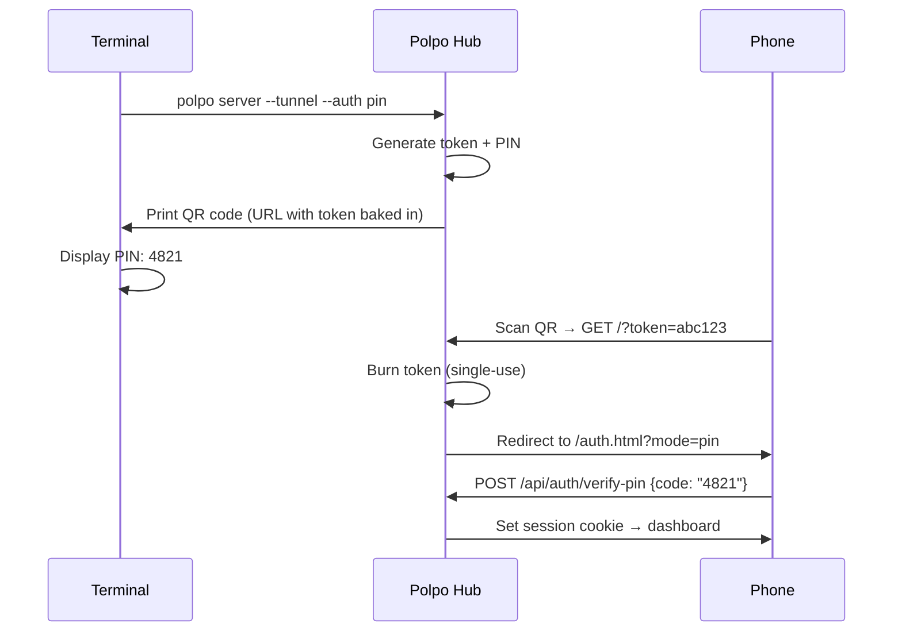
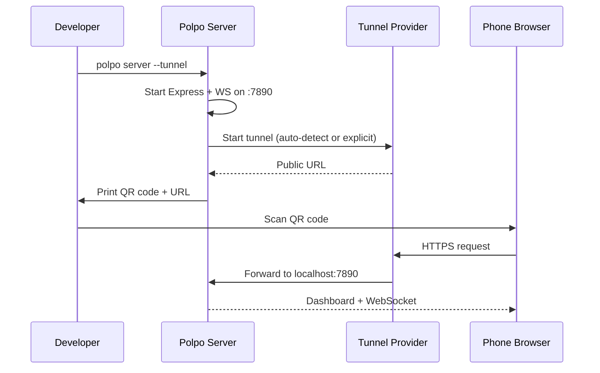
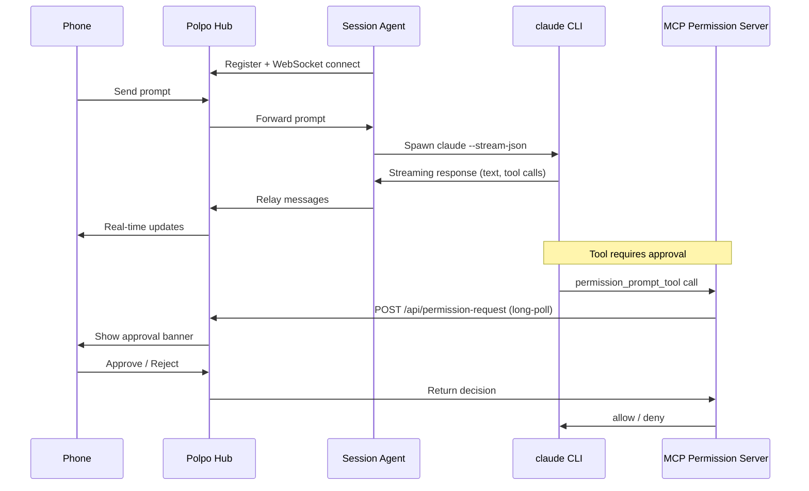
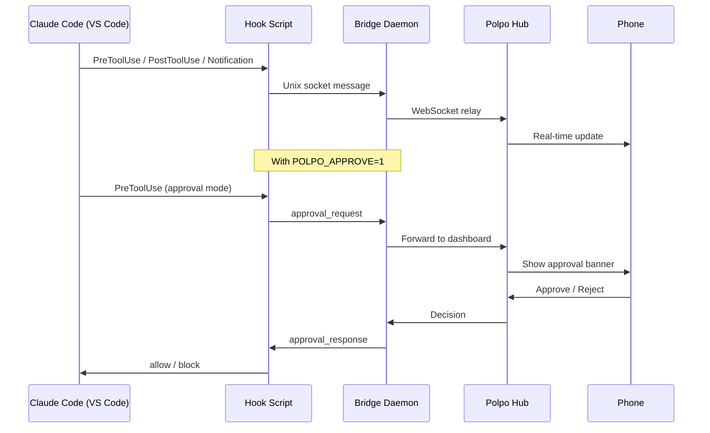

# Polpo Diagrams

## Auth Flow

```mermaid
sequenceDiagram
    participant Term as Terminal
    participant Hub as Polpo Hub
    participant Phone as Phone

    Term->>Hub: polpo server --tunnel --auth pin
    Hub->>Hub: Generate token + PIN
    Hub->>Term: Print QR code (URL with token baked in)
    Term->>Term: Display PIN: 4821
    Phone->>Hub: Scan QR → GET /?token=abc123
    Hub->>Hub: Burn token (single-use)
    Hub->>Phone: Redirect to /auth.html?mode=pin
    Phone->>Hub: POST /api/auth/verify-pin {code: "4821"}
    Hub->>Phone: Set session cookie → dashboard
```

## Tunnel Flow

```mermaid
sequenceDiagram
    participant Dev as Developer
    participant Polpo as Polpo Server
    participant Tunnel as Tunnel Provider
    participant Phone as Phone Browser

    Dev->>Polpo: polpo server --tunnel
    Polpo->>Polpo: Start Express + WS on :7890
    Polpo->>Tunnel: Start tunnel (auto-detect or explicit)
    Tunnel-->>Polpo: Public URL
    Polpo->>Dev: Print QR code + URL
    Dev->>Phone: Scan QR code
    Phone->>Tunnel: HTTPS request
    Tunnel->>Polpo: Forward to localhost:7890
    Polpo-->>Phone: Dashboard + WebSocket
```

## Session Flow

```mermaid
sequenceDiagram
    participant Phone
    participant Hub as Polpo Hub
    participant Agent as Session Agent
    participant CLI as claude CLI
    participant MCP as MCP Permission Server

    Agent->>Hub: Register + WebSocket connect
    Phone->>Hub: Send prompt
    Hub->>Agent: Forward prompt
    Agent->>CLI: Spawn claude --stream-json
    CLI->>Agent: Streaming response (text, tool calls)
    Agent->>Hub: Relay messages
    Hub->>Phone: Real-time updates

    Note over CLI,MCP: Tool requires approval
    CLI->>MCP: permission_prompt_tool call
    MCP->>Hub: POST /api/permission-request (long-poll)
    Hub->>Phone: Show approval banner
    Phone->>Hub: Approve / Reject
    Hub->>MCP: Return decision
    MCP->>CLI: allow / deny
```

## Hook Flow

```mermaid
sequenceDiagram
    participant CC as Claude Code (VS Code)
    participant Hook as Hook Script
    participant Bridge as Bridge Daemon
    participant Hub as Polpo Hub
    participant Phone

    CC->>Hook: PreToolUse / PostToolUse / Notification
    Hook->>Bridge: Unix socket message
    Bridge->>Hub: WebSocket relay
    Hub->>Phone: Real-time update

    Note over Hook,Bridge: With POLPO_APPROVE=1
    CC->>Hook: PreToolUse (approval mode)
    Hook->>Bridge: approval_request
    Bridge->>Hub: Forward to dashboard
    Hub->>Phone: Show approval banner
    Phone->>Hub: Approve / Reject
    Hub->>Bridge: Decision
    Bridge->>Hook: approval_response
    Hook->>CC: allow / block
```
