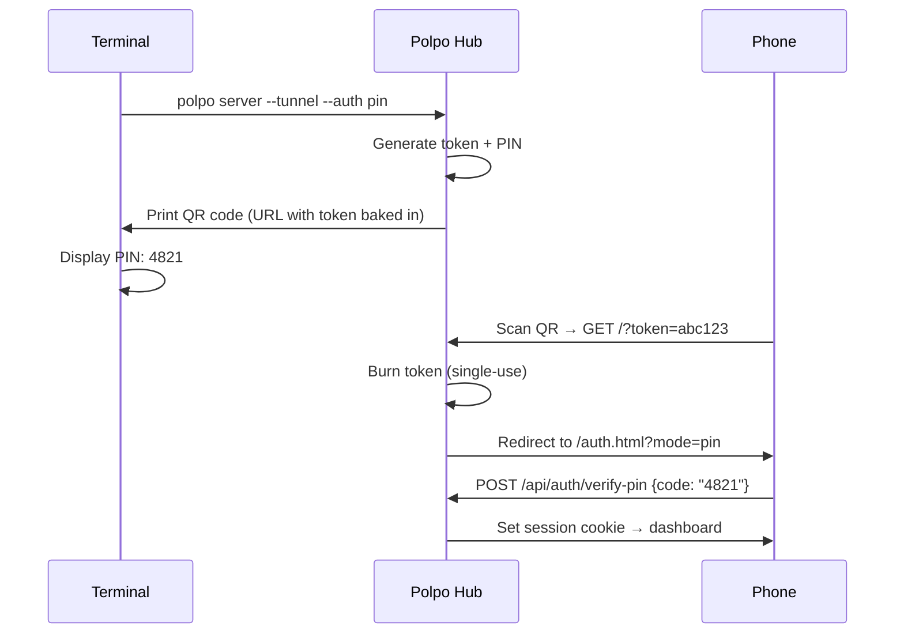
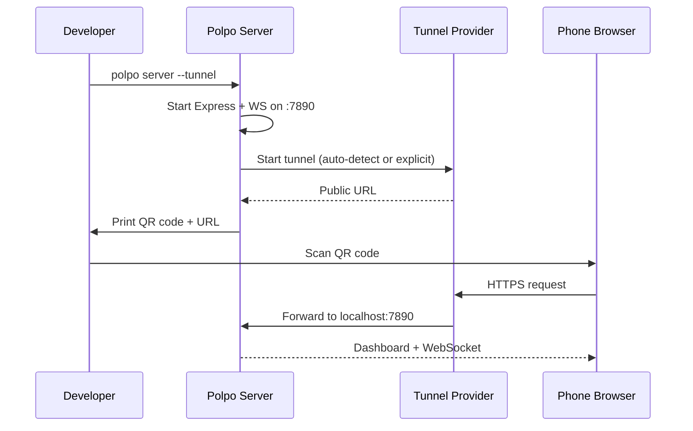
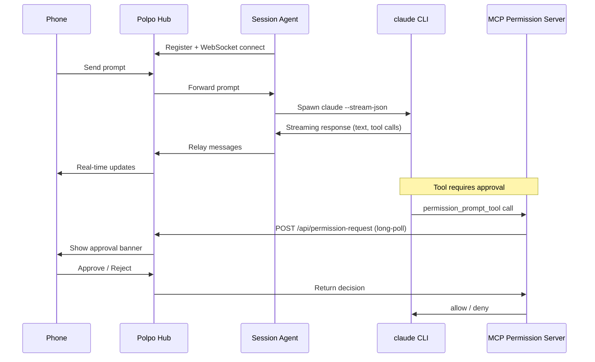
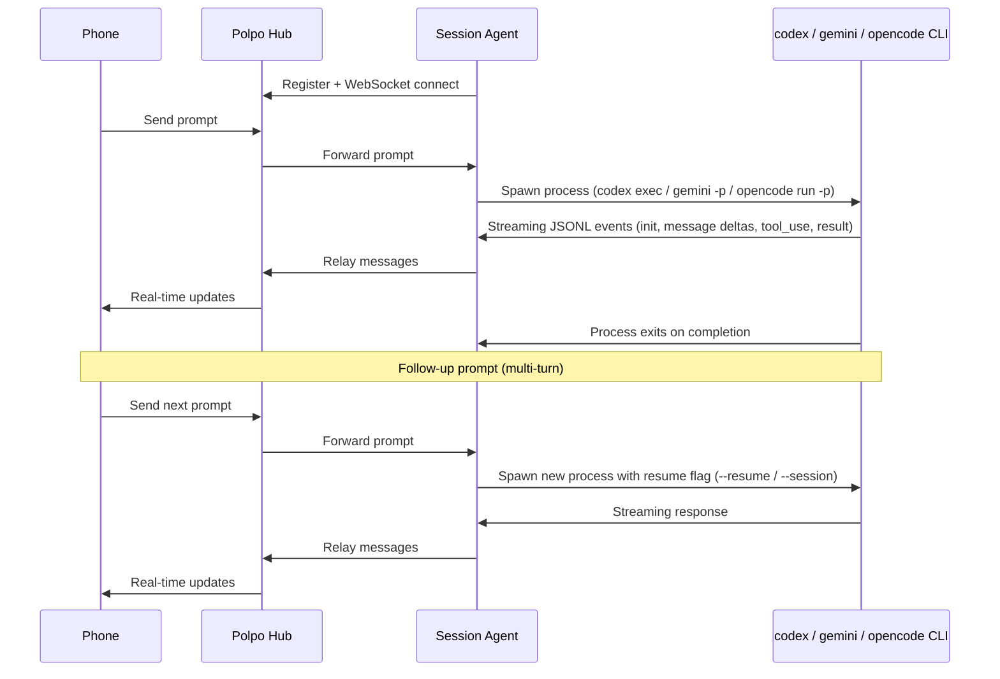
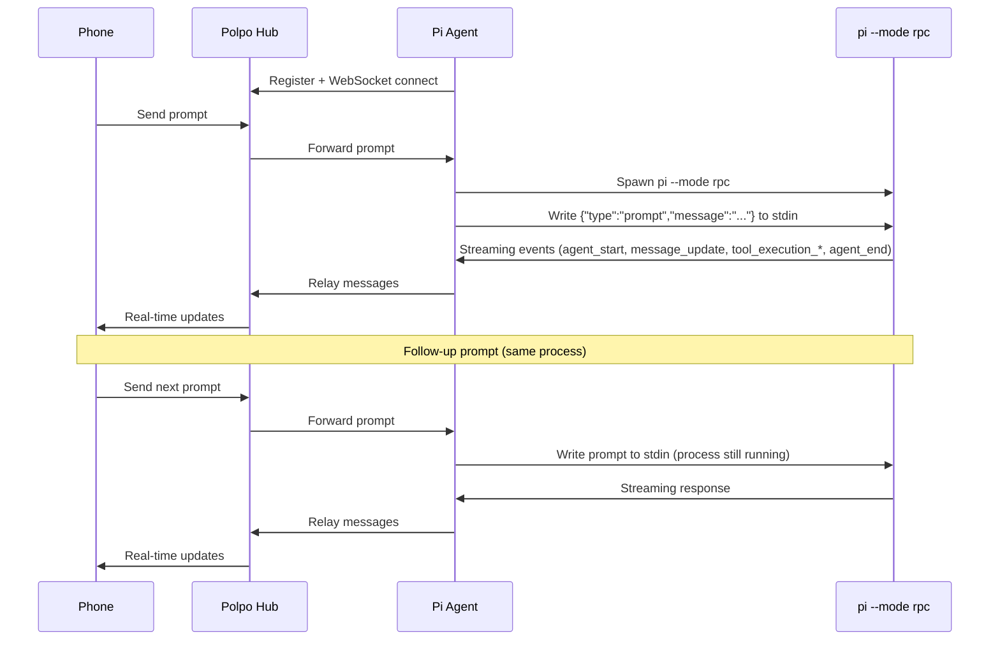
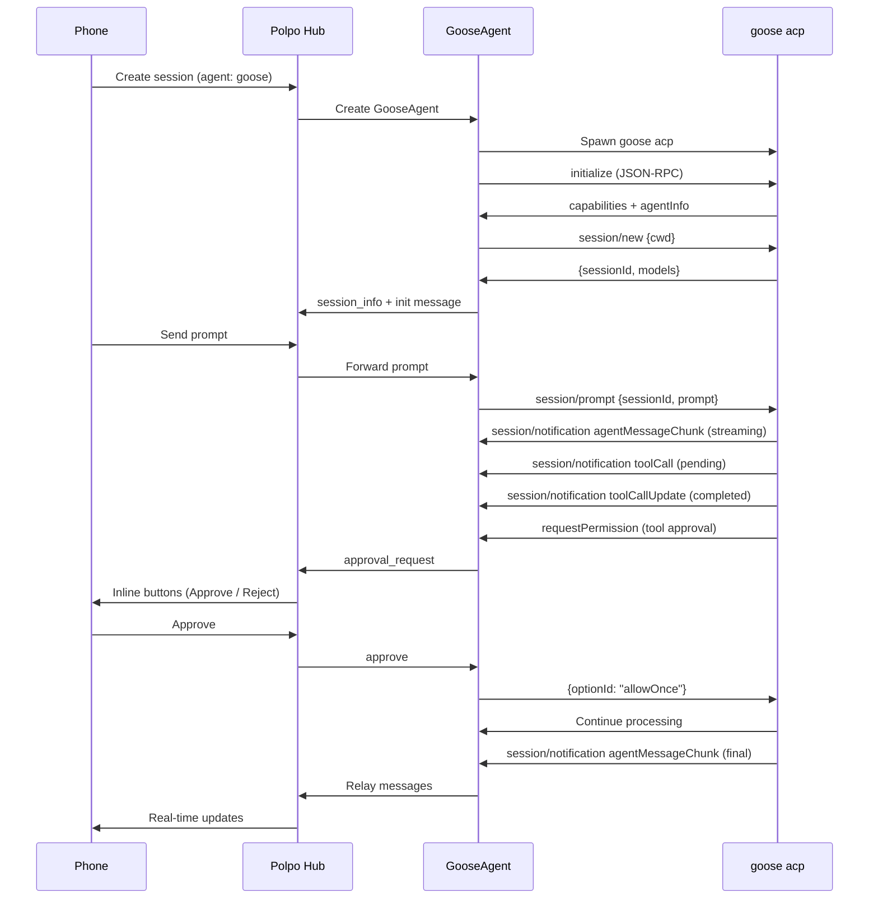
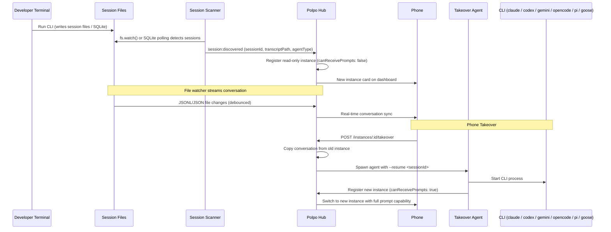
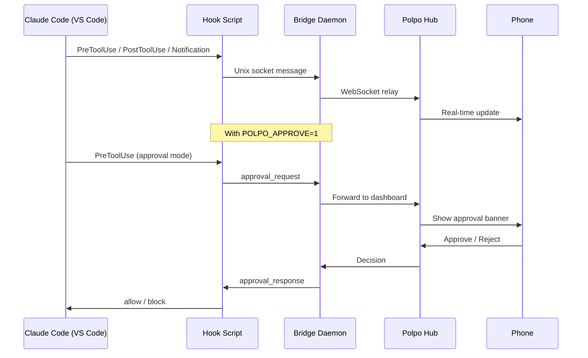
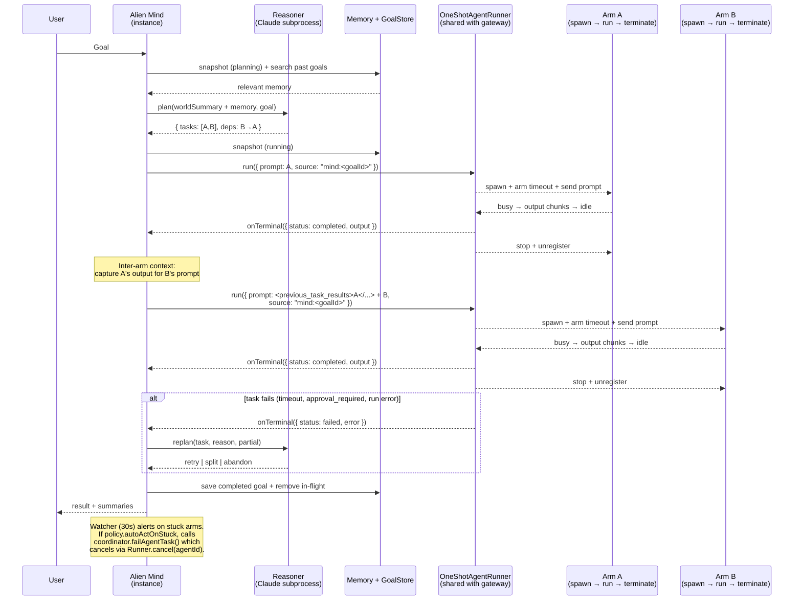

# Polpo Diagrams

## Auth Flow



## Tunnel Flow



## Session Flow (Claude)



## Session Flow (Codex / Gemini / OpenCode)

Codex, Gemini, and OpenCode use one-shot process invocation instead of long-running stdin streaming. Each prompt spawns a new process; multi-turn uses resume flags.



## Session Flow (Pi)

Pi uses a long-running RPC mode (`pi --mode rpc`) — persistent stdin/stdout JSON, same pattern as Claude Code. The process stays alive across prompts.



## Session Flow (Goose)

Goose uses ACP mode (`goose acp`) with JSON-RPC 2.0 over stdin/stdout. The process stays alive across prompts, similar to Pi's RPC mode.



## Auto-Discovery & Takeover Flow



## Hook Flow



## Gateway Flow (Bidirectional File Transfer)

```mermaid
sequenceDiagram
    participant Caller as External Caller<br/>(script, bot, agent)
    participant GW as Polpo Gateway<br/>/v1/*
    participant US as UploadStore
    participant AS as ArtifactStore
    participant Arm as Spawned Agent
    participant Phone as Phone Dashboard

    Note over Caller,Phone: Bearer POLPO_GATEWAY_KEY on every request

    Caller->>GW: POST /v1/uploads
    GW->>US: put(buffer, tokenFingerprint)
    US-->>GW: uploadId + sha256 + expiresAt
    GW-->>Caller: 201

    Caller->>GW: POST /v1/tasks { attachments, captureArtifacts:true }
    GW->>US: get(uploadId, fingerprint)
    Note over GW: Copies upload into UPLOAD_DIR<br/>(reuses dashboard trust boundary)
    GW->>AS: createDir(taskId)
    GW->>Arm: spawn + inject <polpo:artifacts> directive
    GW-->>Caller: 201 taskId

    Caller->>GW: GET /v1/tasks/:id/stream
    Arm-->>GW: assistant output
    GW-->>Caller: event: chunk

    Note over Arm: Arm writes files<br/>into artifacts dir
    Arm-->>GW: status: idle
    GW->>AS: sealOnFinalize(taskId)
    Note over AS: lstat + size caps + hardlink to sealed/<br/>+ chmod 0o400 (TOCTOU defence)
    GW-->>Caller: event: artifacts
    GW-->>Caller: event: done

    Caller->>GW: GET /v1/tasks/:id/artifacts/:name
    GW->>AS: openSealed(taskId, name, fingerprint)
    GW-->>Caller: 200 + attachment + nosniff

    Note over Phone: Phone sees the arm as<br/>"Gateway: &lt;client&gt;" — can<br/>observe or abort live
```

## Alien Mind Flow (Multi-Agent Coordination)

Every mind-spawned arm goes through the same `OneShotAgentRunner` primitive the HTTP gateway uses. Each task = one fresh agent + one prompt + one captured result + terminate. No pool, no reuse.


